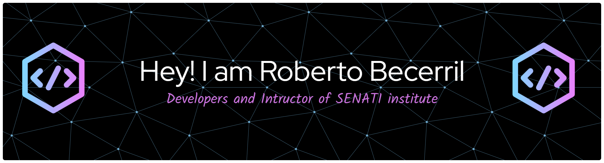

# Bienvenido a mi  GITHUB  👋
===========================================
<!--
>>>>>>> a930d72024ebb667d8fc709e90084b585f0861da
<!--**robertoBCV/robertoBCV** is a ✨ _special_ ✨ repository because its `README.md` (this file) appears on your GitHub profile.
Here are some ideas to get you started:

- 🔭 I’m currently working on ...
- 🌱 I’m currently learning ...
- 👯 I’m looking to collaborate on ...
- 🤔 I’m looking for help with ...
- 💬 Ask me about ...
- 📫 How to reach me: ...
- 😄 Pronouns: ....
- ⚡ Fun fact: ...
-->

<h2>Lenguajes de progamación </h2>

<!-- gifphy-->

  

<!-- Redes Sociales-->

  
  
  
  
  

Editores de código

Lenguajes de maketado

IoT 
<a>

